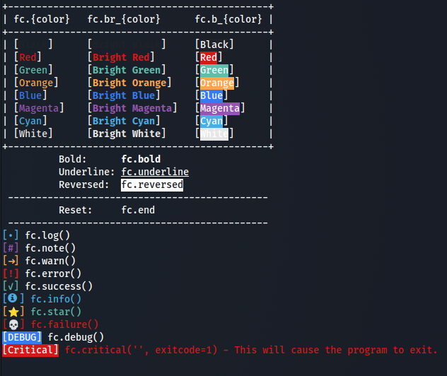

# `pyfc`


**Python format colors** is a mini library that prepares some basic ANSI color codes and log functions, allowing the programmer to concentrate on functionality instead of wasting time on creating pretty format strings.

## Usage

**Print an example output with the available colors and log functions:**
```python
from pyfc import fc

fc.test() # For the ouput - see "Example" below
```

**Using `fc`**
```python
from pyfc import fc

# Log functions
fc.clear_screen()
fc.log('Basic log message')
fc.failure('Shit's about to blow up! Take cover!')

# Using color codes in normal format strings
print(f'{fc.green}This is green text.{fc.end}')

# Customizing log functions
fc.warn('This is an indented warning with a custom icon and no new line', start='\t', icon='XXX', end='')
```

## Example


